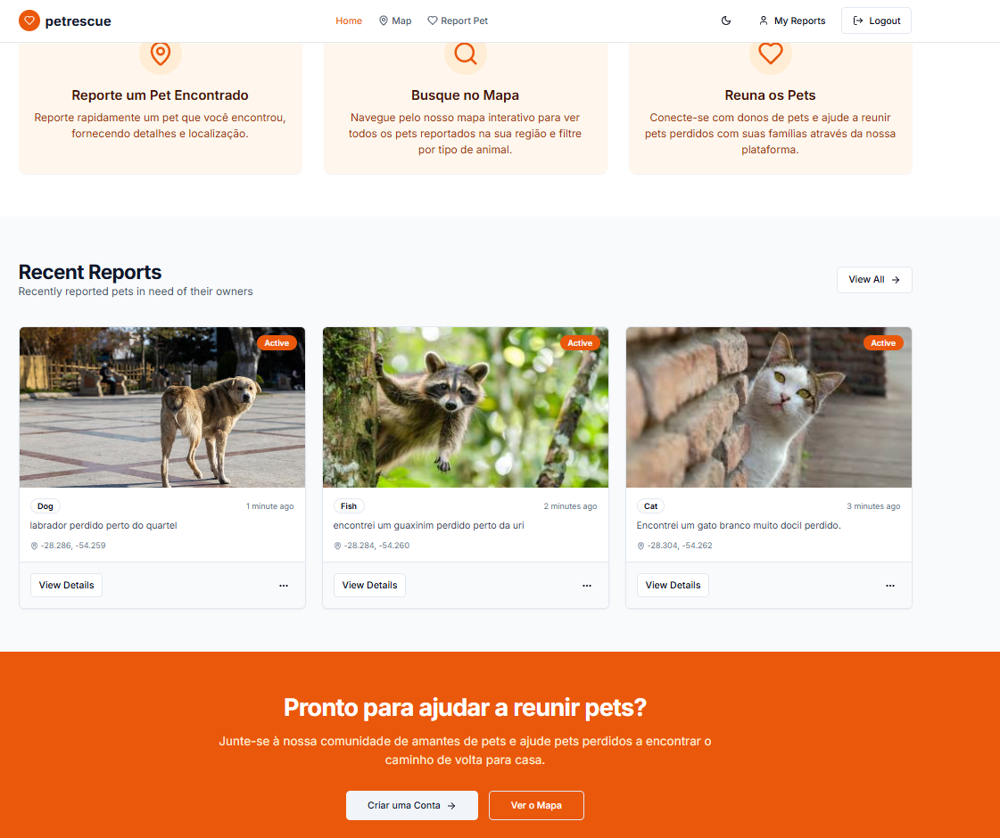

# Pet Reports — Sistema de Relatórios de Resgate Animal

Aplicação completa para ajudar pessoas a reportar e encontrar animais perdidos usando geolocalização, upload de imagens e colaboração da comunidade, inicialmente focada na cidade de Cerro Largo.

## Screenshots




## Funcionalidades

- Autenticação segura de usuários com JWT
- Relatórios de pets com localização no mapa
- Upload de imagens via Cloudinary
- Busca avançada com filtros (tipo, bairro, data, status)
- Visualização interativa de relatórios no mapa
- Gerenciamento de roles de usuário (admin, user)
- API RESTful com documentação Swagger
- Interface responsiva (em desenvolvimento)

## Tecnologias

### Backend
- Java 17, Spring Boot 3.2.3, Spring Security (JWT)
- PostgreSQL, Hibernate (JPA)
- Cloudinary (armazenamento de imagens)
- Swagger (OpenAPI)
- Maven

## Como Executar

### Backend

1. Instale Java 17 e Maven
2. Configure o banco de dados PostgreSQL e credenciais do Cloudinary em `application.properties`
3. Execute:
   ```bash
   mvn spring-boot:run
   ```
4. Acesse a documentação da API: [http://localhost:8080/swagger-ui.html](http://localhost:8080/swagger-ui.html)

### Frontend

1. Instale as dependências com `npm install` ou `pnpm install` no diretório `pet-reports-frontend`
2. Configure `NEXT_PUBLIC_API_URL` se necessário
3. Execute:
   ```bash
   npm run dev
   ```
4. Acesse a interface em [http://localhost:3000](http://localhost:3000)

## Documentação

- [Modelo de Dados](database.md)
- [Endpoints da API](api.md)

## Modelo de Dados

### Usuários
- id (UUID), name, email, password (BCrypt), role (USER/ADMIN)

### Relatórios
- id (UUID), user, animal type, description, image, latitude, longitude, date, status (resolved)

Veja detalhes em [database.md](database.md).

## Endpoints Principais

- `POST /api/auth/register` — Registro de usuário
- `POST /api/auth/login` — Login de usuário
- `POST /api/reports` — Criar relatório (com imagem e localização)
- `GET /api/reports/search` — Buscar relatórios com filtros
- `PATCH /api/reports/:id/resolve` — Marcar relatório como resolvido
- `DELETE /api/reports/:id` — Deletar relatório (admin/user)

Exemplos completos e formatos de resposta em [api.md](api.md).

